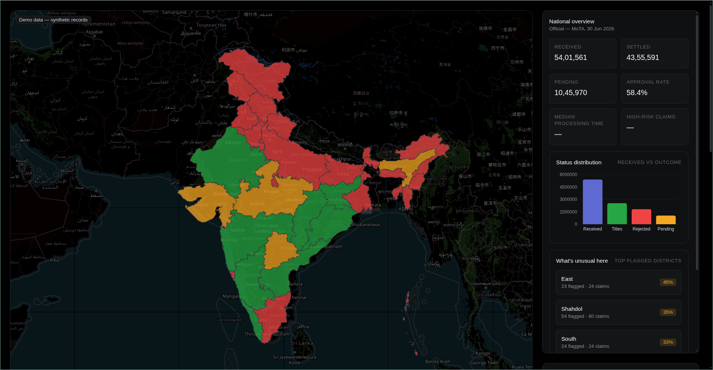
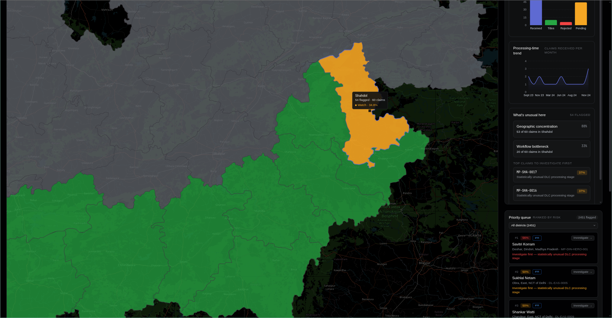

# FRA Intelligence & Decision Support Platform

A small web app built over a hackathon weekend (two people, ~12 hours) to help officials working under India's **Forest Rights Act (2006)** answer one question: **which claims need attention first, and why?**

It's a map of India where states and districts are coloured by risk, backed by a small analytics engine that flags suspicious claims, a drill-down screen that shows the evidence behind every flag, and an AI assistant that explains that evidence in plain language. The AI never decides anything — it explains, and a human makes the call.

Everything runs in the browser. There's no backend and no database; the only server-side code in the repo is a single function that proxies the AI call.

## Why this exists

The FRA lets forest-dwelling families claim rights over land they've lived on and farmed for generations. A claim moves through the Gram Sabha, then the sub-divisional committee (SDLC), then the district committee (DLC), and finally becomes a title deed. The numbers, as of 30 June 2026:

- 54 lakh+ claims filed
- 25 lakh+ titles granted
- 18 lakh+ rejected
- 10 lakh+ still pending

Officials are drowning in that pile. Duplicate claims on the same land, claimed areas that don't match the official record, claims stuck at one stage for years, clusters of claims in odd corners of a district — there's no tool that says where to look first. So anomalies get missed and genuine claimants wait. This app is a (very) small attempt at fixing that.

## What it does: one loop

**Monitor → Detect → Investigate → Explain → Prioritize**

1. **Monitor** — a national choropleth map. States and districts are green (normal), amber (watch), or red (high risk); hovering a region shows the number behind the colour.
2. **Detect** — four deterministic detectors run client-side over committed JSON: unusually long processing times (IQR), land-record mismatches above 30%, near-duplicate claims (Jaccard similarity), and spatial clusters from 0.25° grid binning. No ML, no training — every signal is a short, explainable function.
3. **Investigate** — click a flagged claim to open its workspace: identity card, stage-by-stage timeline with dates and durations, claimed vs recorded land area side by side, a small map with the claim and its grid cell, and a "Why was this flagged?" panel listing the exact signals with the exact numbers.
4. **Explain** — the "Run AI investigation" button turns that structured evidence into a narrative: findings, reasoning, confidence, limitations, open questions. The prompt is hard-wired so the AI can't invent anomalies, can't call a claim valid or invalid, and can't claim a legal deadline was missed. If the AI is unreachable, a deterministic template renders the same evidence as sentences — the demo survives the network going away.
5. **Prioritize** — a queue ranked by risk score, each row carrying its dominant reason ("Investigate first — unusually slow SDLC stage") and a one-click path back into the evidence.

## Screenshots





## Running it

```bash
npm install
npm run dev
```

That's it for local dev. For a production build:

```bash
npm run build   # type-checks and builds to dist/
npm run preview # serve the build locally
```

The repo also has a `bun.lock`, so `bun install && bun dev` works if you prefer bun.

One honest caveat: the AI button posts to `/api/investigate`, which only exists on the Vercel deployment (and needs a `GEMINI_API_KEY`). Under plain `vite dev` the button shows a "AI service unreachable" box with the raw evidence instead — deliberate, so nothing hard-fails locally.

### Deploying to Vercel

Import the repo with the Vite framework preset, set `GEMINI_API_KEY` in the project environment, deploy. `vercel.json` handles the SPA rewrite and the function config. Nothing else is needed.

## Data: real state numbers, synthetic claims

There are two kinds of data in this project, and the difference matters:

- **Real, official state-level figures** power the national overview — Ministry of Tribal Affairs numbers from a Lok Sabha answer (data as of 30 Jun 2026), committed in `data/state-stats.json`.
- **Everything below the state level is synthetic.** There are no publicly available district-level FRA numbers, so the drill-down runs on generated claim records: ~5,800 fake claims across ~230 districts, built by a seeded script and committed as `data/generated/claims.json`. They're designed around five anomaly scenarios, with Madhya Pradesh as the demo focus (the hero claim lives in Dindori).

The app labels synthetic data as "Demo data — synthetic records" on every screen, and it's worth repeating: **no claim in this app is real, and nothing here makes decisions about real people's land.** It's a proof of concept for a workflow.

## Stack

| Piece     | Choice                                                                       |
| --------- | ---------------------------------------------------------------------------- |
| App       | Vite + React 19 + TypeScript (single-page)                                   |
| Styling   | Tailwind CSS v4                                                              |
| Map       | react-leaflet 5 + Leaflet 1.9.4, choropleth over GeoJSON                     |
| Charts    | recharts                                                                     |
| AI        | Google Gemini (flash model), one Vercel serverless function                  |
| Analytics | plain TypeScript in the browser — IQR, Jaccard, grid binning, weighted score |

The deliberate bet: keep everything heavy in the browser over committed JSON, so the app works offline and stays trivially inspectable. The only server piece is the AI proxy, because an API key can't live in the client.

## Project structure

```
averis-fra/
├── api/investigate.ts          # the only server code: Gemini proxy + template fallback
├── data/
│   ├── states.geojson          # India states (datameet, CC BY 4.0)
│   ├── districts.geojson       # Census-2011 districts (datameet, CC BY 4.0)
│   ├── state-stats.json        # real MoTA state figures
│   └── generated/claims.json   # synthetic claims (seeded generator)
├── scripts/                    # data generator + validators (dev-only)
└── src/
    ├── analytics/              # the four detectors + risk scoring
    ├── components/             # map, dashboard, queue, investigation
    └── lib/                    # shared types and geo helpers
```

## Attributions

- India administrative boundaries: [datameet/maps](https://github.com/datameet/maps), **CC BY 4.0**. (Their repo's license files disagree with each other — root says MIT, the districts folder says CC BY 2.5 India — we attribute per the repo-wide README.)
- State FRA figures: Ministry of Tribal Affairs, via [Lok Sabha answer, 23 Jul 2026](https://sansad.in/getFile/lsapps/loksabhaquestions/annex/188/AU756_yijOS0.pdf) (as of 30 Jun 2026).
- Map tiles: © [OpenStreetMap](https://www.openstreetmap.org/copyright) contributors.
- Mapping library: [react-leaflet](https://react-leaflet.js.org/) + [Leaflet](https://leafletjs.com/).

## Caveats

Hackathon build, not a government system. No authentication, no live data integration, no real-time anything. The analytics are intentionally simple and explainable rather than fancy, and the whole thing exists to demonstrate an evidence-backed, human-in-the-loop triage workflow — not to replace a human decision.
